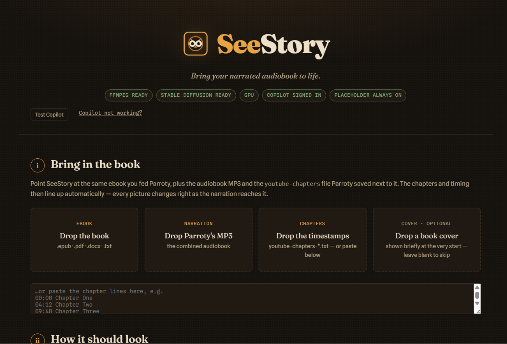
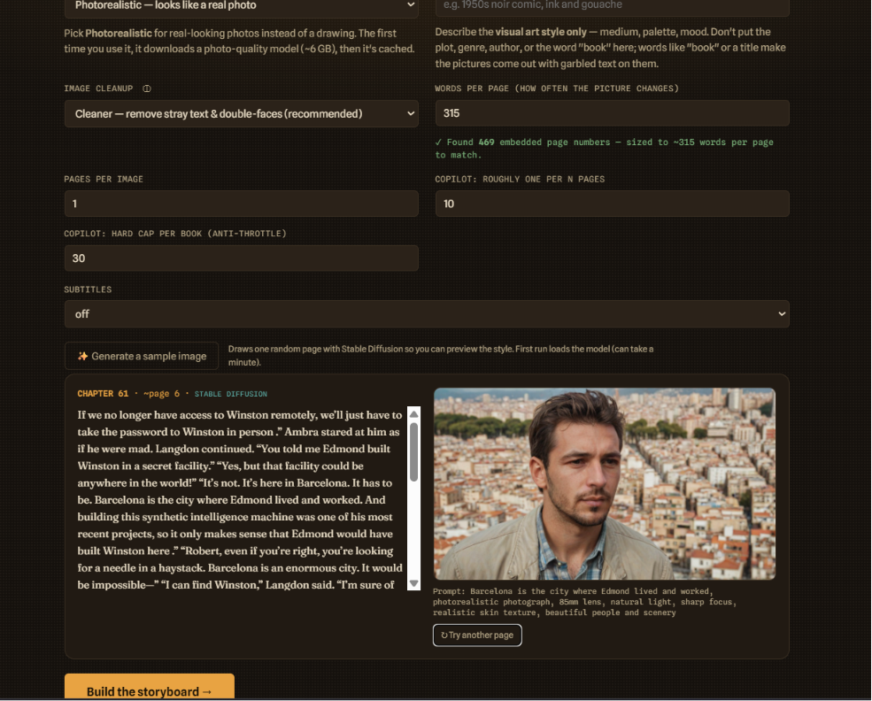
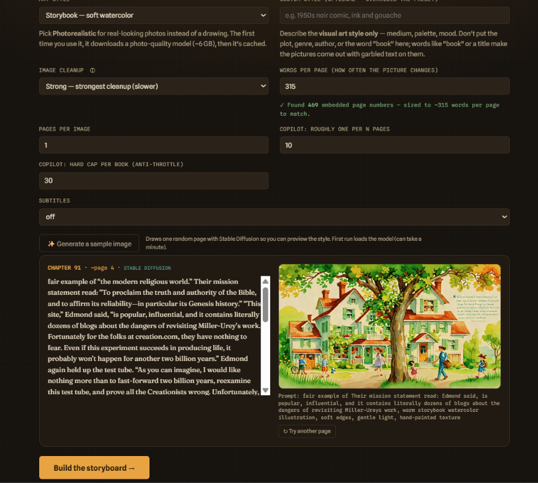
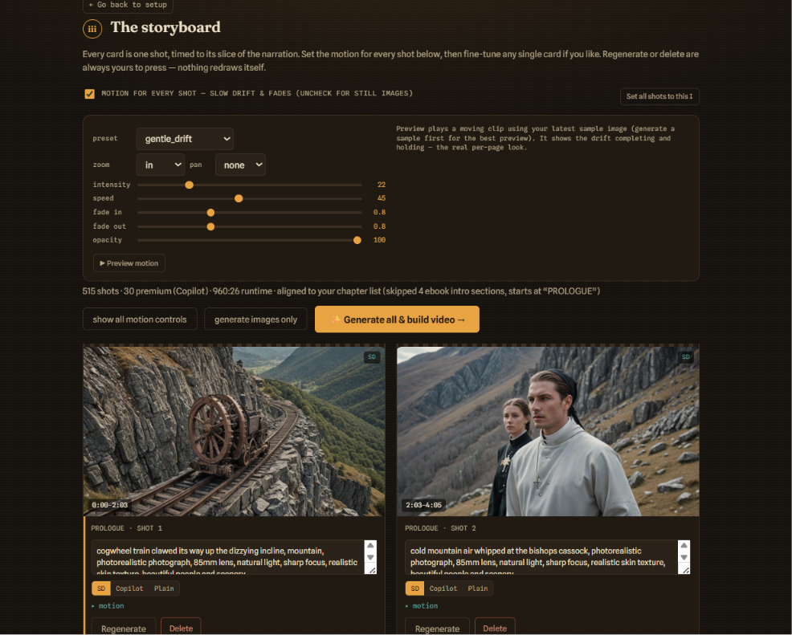

# SeeStory

**Bring your narrated audiobook to life.**

SeeStory turns a finished [Parroty](https://github.com/pgotta/Parroty) audiobook
into a watch‑along illustrated MP4. It reads the *same* ebook with the *same*
parser Parroty uses, lays the chapters onto Parroty's narration MP3, breaks each
chapter into timed "shots," draws a picture for each one, gives every still a
slow Ken Burns drift, and stitches the whole thing into one chaptered MP4 —
perfectly in sync, because each picture is timed to its slice of the narration.

It runs entirely on your machine at **http://127.0.0.1:5001**, so it sits happily
beside Parroty (which uses port 5000).

---

## Table of Contents

- [Requirements & disk space](#requirements--disk-space)
- [Quick start (Windows)](#quick-start-windows)
- [The image sources](#the-image-sources)
- [Choosing the look](#choosing-the-look)
- [Using it](#using-it)
- [Motion controls](#motion-controls)
- [Cover, subtitles, resume](#cover-subtitles-resume)
- [What you get](#what-you-get)
- [Optional: enable Copilot](#optional-enable-copilot)
- [Troubleshooting](#troubleshooting)
- [The launchers (.bat files)](#the-launchers-bat-files)
- [Credits](#credits)

---

## Requirements & disk space

> **FYI — read before installing.** The local image models are large. Make sure
> you have the room and a supported GPU.

**Tested on:** Windows 11, **NVIDIA RTX 5060 Laptop GPU (8 GB VRAM)**,
PyTorch + CUDA, Python 3.12. It's a solo‑developer project built and run on that
exact setup — other configurations should work but haven't been exercised.

| Need | Detail |
|------|--------|
| OS | Windows 10/11 (the `.bat` launchers are Windows‑only) |
| GPU | NVIDIA with CUDA. **8 GB VRAM is enough** thanks to fp16 + attention slicing + VAE tiling + CPU offload. CPU‑only works but is *very* slow. |
| ffmpeg | Required — it does all the video work. `winget install ffmpeg` |
| Python | 3.10+ (3.12 recommended) |

**Disk space — budget ~20–25 GB free:**

| Item | Approx. size | When |
|------|-------------|------|
| Python venv (PyTorch + CUDA + diffusers) | ~6–8 GB | at setup |
| Stable Diffusion turbo model | ~7 GB | first time you generate with SD |
| Photorealistic model (RealVisXL Lightning) | ~7 GB | first time you pick the **Photorealistic** style |
| Copilot's Chromium (optional) | ~0.5 GB | only if you enable Copilot |
| Your generated images / clips / MP4 | varies (a long book can be several GB) | as you build |

Models are downloaded once and cached in your Hugging Face cache
(`%USERPROFILE%\.cache\huggingface`), so they're only fetched the first time.
You can skip the Stable Diffusion download entirely with `setup.bat nosd` and
still run the whole pipeline on placeholder frames (and Copilot, if enabled).

---

## Quick start (Windows)

1. **`setup.bat`** — builds the virtual environment, installs the app, then
   installs the local Stable Diffusion backend (PyTorch/CUDA + diffusers). To
   skip that big download for now, run `setup.bat nosd`.
2. **Install ffmpeg:** `winget install ffmpeg`, then restart the terminal.
3. **`run.bat`** — Chrome opens at http://127.0.0.1:5001. Keep this window open
   while generating.

Have these three ready (all come from Parroty): the **same ebook** you fed
Parroty, Parroty's combined **MP3**, and Parroty's **`youtube-chapters‑*.txt`**
(or paste the `MM:SS Title` lines). Those timestamps are how the pictures line
up with the voice.

> Copilot is **optional** and off by default — see
> [Optional: enable Copilot](#optional-enable-copilot). SeeStory is fully
> functional without it.

---

## The image sources

You choose per book, and can override any single shot by hand:

- **Stable Diffusion (local)** — the every‑page workhorse. Free, private, runs on
  your own GPU, no account, no limits. The default for most shots.
- **Copilot (optional, premium)** — drives Microsoft Copilot's own image
  generation via the optional
  [Windows‑Copilot‑API](https://github.com/sums001/Windows-Copilot-API).
  Gorgeous, but it's a personal bridge processed one request at a time, so
  SeeStory **saves it for the standout moments**, spaces the calls apart, and
  enforces a **hard cap per book**. Entirely optional.
- **Placeholder** — a captioned frame that needs nothing installed. The fallback,
  and it lets you test the whole pipeline (timing → motion → final video) before
  downloading any models.

**Modes:** *Both* (SD everywhere, Copilot promoted to the most exciting moments),
*Stable Diffusion only* (no credentials at all), or *Copilot only* (capped and
spaced). If a backend isn't available, SeeStory quietly falls back rather than
failing.

---

## Choosing the look

**Art style** (dropdown):

- **Photorealistic** — looks like a real photo, not a drawing. Loads a dedicated
  photo‑quality model (downloads ~7 GB the first time, then cached). Best for
  realistic faces and scenery.
- **Cinematic / Storybook / Noir / Oil / Ink** — illustration looks, drawn with
  the fast local model.

**Custom style** (optional) overrides the preset — but put **visual style words
only** (medium, palette, lighting), never the plot, genre, author, or the word
"book." Genre/author words get painted into the image as garbled text.

**Image cleanup** controls how hard Stable Diffusion works to avoid stray text,
watermarks and distorted/double faces:

- **Cleaner** (recommended) — removes most accidental text and duplicate faces.
- **Classic turbo** — fastest, original look, but artifacts can slip in.
- **Strong** — strongest cleanup and prompt adherence; slowest, can look a touch
  oversaturated. Best when faces double up.

Use **Generate a sample image** to preview the exact style, model and cleanup
setting on one random page before committing to a full build.

---

## Using it

1. **Bring in the book** — the same ebook, Parroty's MP3, and the chapter
   timestamps.
2. **Choose the look** — mode, art style, words‑per‑page (how often the picture
   changes), and the Copilot interval + hard cap.
3. **The storyboard** — every card is one shot, timed to its narration slice.
   Edit its prompt, switch its source (SD / Copilot / Plain), or open **motion**
   to tune it. ★ highlight shots are the ones routed to Copilot.
4. **Generate** — watch each shot fill in. Copilot shots pause a few seconds
   between calls on purpose — that's the throttle.
5. **Stitch** — each still becomes a Ken Burns clip exactly as long as its
   narration slice; they're joined and the MP3 is laid underneath with the same
   chapter bookmarks Parroty made. Download the MP4.

**One click does it all:** **✨ Generate all & build video →** runs generation and
stitching back to back and drops you at the finished MP4, download links, a build
log, and a scene‑breakdown table. Re‑running generation **skips images already
done**, so it always picks up where it left off.

**Regenerate** and **Delete** are always yours to press — nothing ever redraws or
removes a shot on its own. (Regenerating a shot also refreshes its prompt with
the latest clean‑up logic, unless you've hand‑edited that prompt.)

---

## Motion controls

Per shot (or applied to all at once), with live sliders:

- **zoom** — none / in / out
- **pan** — none / left / right / up / down
- **intensity** — how far the image travels
- **speed** — easing: quick start vs. slow build
- **fade in / fade out** — seconds up from / down to black
- **opacity** — gently dims the clip toward black for a "lights‑down" look

This is motion on a still (ffmpeg `zoompan`), not generative video — the slow
drift‑and‑fade you want, fast and free enough to run on a whole book. Six presets
are included (gentle drift, slow reveal, pan left/right, dramatic push, still).
Hit **▶ Preview motion** to watch a short clip before you build.

---

## Cover, subtitles, resume

**Book cover (optional):** drop a cover image alongside the ebook and it plays as
a short title card at the very start, fading into the first illustration. Chapter
bookmarks (and the YouTube/Drive chapter files) shift to match, with a 0:00 cover
entry so YouTube still accepts them.

**Subtitles (optional):** *off*, *soft* (a track viewers can toggle), or
*burned‑in*. For exact timing, drop in the `.srt` Parroty exports (its timings are
ground truth). Otherwise SeeStory auto‑generates approximate subtitles from the
ebook text.

**Resume / restore:** every session is saved as it goes. If SeeStory is closed,
crashes, or runs out of memory, reopen it and a **Resume a recent session** panel
appears — pick the project and continue.

---

## What you get

In `output/<book>-<timestamp>/`:

- `seestory-<book>.mp4` — the final video, with embedded chapter bookmarks.
- `youtube-chapters-<book>.txt` — paste into a YouTube description for auto chapters.
- `drive-chapters-<book>.html` — a clickable chapter index for Google Drive playback.
- `subtitles-<book>.srt` — if subtitles were enabled.
- `images/` and `clips/` — the individual stills and motion clips.
- `project.json` — the whole storyboard, so a project survives a restart.

---

## Optional: enable Copilot

Copilot is an **optional** premium image source — SeeStory works fully without
it. The Windows‑Copilot‑API library it uses is **not included in this repo**; add
it only if you want Copilot. See **[BUILD.md](BUILD.md#optional-the-copilot-library)**
for the one‑time setup (clone the library into a `Windows-Copilot-API` folder,
then run the Copilot launchers).

Once the library is in place:

1. Run **`setup_copilot.bat`** — installs its dependencies and the Playwright
   Chromium used for sign‑in (or `setup.bat` does this automatically when the
   `Windows-Copilot-API` folder is present).
2. Double‑click **`login_copilot.bat`** — a Google Chrome window opens for a
   one‑time Microsoft sign‑in and closes itself when done.
3. Restart SeeStory. The **copilot** badge turns green. Click **Test Copilot** in
   the header to fire one real call and confirm it works; if it doesn't, the
   **Copilot not working?** link explains exactly what to do.

Copilot has content filters and may decline some prompts — those shots fall back
to Stable Diffusion automatically. Advanced: point it elsewhere with
`SEESTORY_COPILOT_PATH`. If Microsoft changes their protocol and you get an
"invalid‑event" error, update the `Windows-Copilot-API\copilot` folder from
[the repo](https://github.com/sums001/Windows-Copilot-API).

---

## Troubleshooting

- **Keep the console window in the foreground while generating.** Background
  throttling on laptops can starve the GPU; `run.bat` raises process priority and
  disables console QuickEdit to help.
- **ffmpeg missing?** Nothing renders. Install it (above) and restart.
- **Out of VRAM on 8 GB?** SeeStory auto‑retries the image at a smaller size and,
  failing that, drops a placeholder for that one shot rather than crashing the
  run — which, with resume, means a long book finishes even on a tight GPU.
- **Garbled text in images?** Clear the custom‑style box (or use visual words
  only) and set image cleanup to **Strong**.
- **Faces doubling up?** Set image cleanup to **Strong**, or use the
  **Photorealistic** style (its model handles faces far better).
- **Environment overrides:** `SEESTORY_SD_MODEL` (base model),
  `SEESTORY_SD_PHOTOREAL_MODEL` (photo model), `SEESTORY_SD_GUIDANCE`
  (force a guidance value), `SEESTORY_SD_NEGATIVE` (negative prompt).

---

## The launchers (.bat files)

The Windows launchers (`setup.bat`, `run.bat`, etc.) are **not tracked in git** —
they're generated/kept locally. If you cloned this repo and don't have them, see
**[BUILD.md](BUILD.md)** for the full contents and how to recreate each one.

---

## Credits

Made to run beside [Parroty](https://github.com/pgotta/Parroty). The optional
Copilot backend uses the optional
[Windows‑Copilot‑API](https://github.com/sums001/Windows-Copilot-API) by sums001.
Nothing leaves your computer except, if you choose the Copilot backend, the
prompts you send to it.
