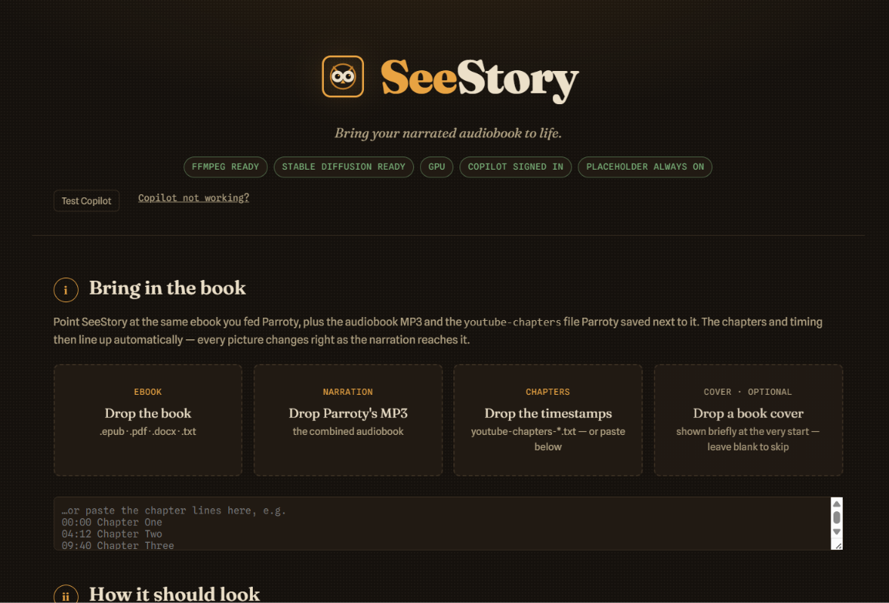
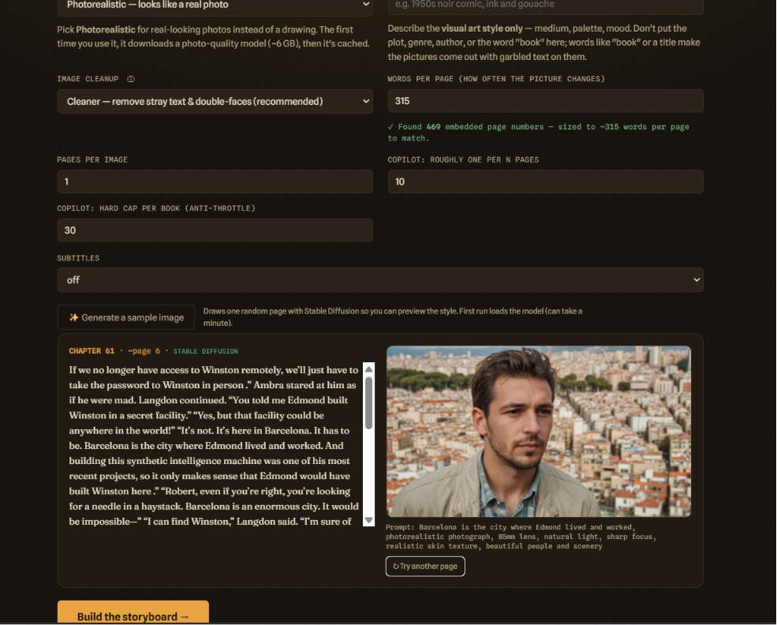
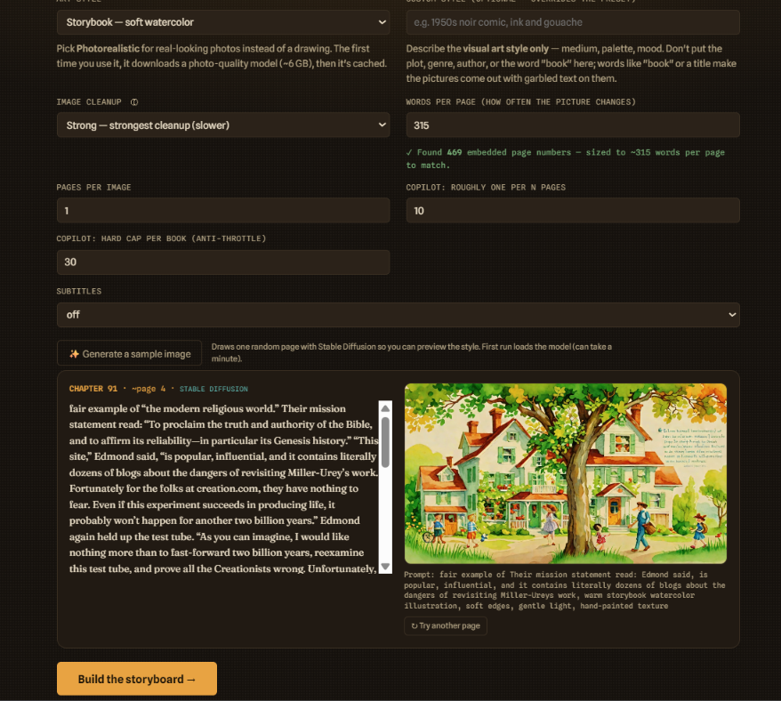
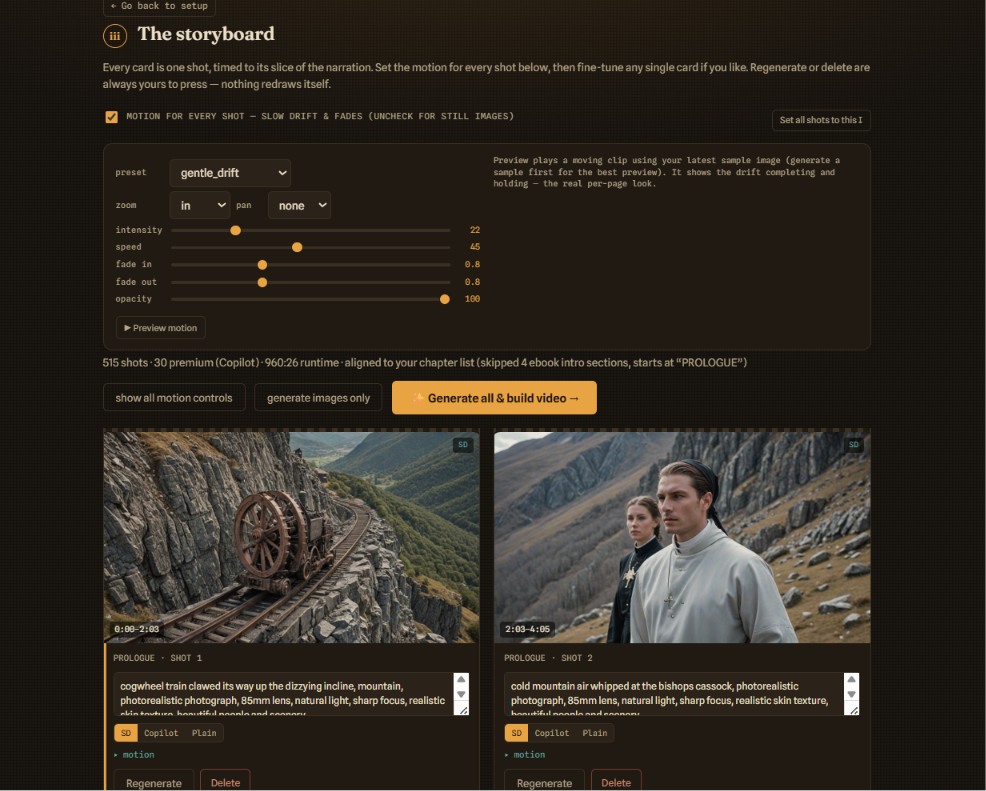

# SeeStory

**Bring your narrated audiobook to life.**

SeeStory turns a finished [Parroty](https://github.com/pgotta/Parroty) audiobook into a synchronized illustrated MP4. It reads the same ebook, aligns it to Parroty's narration timestamps, builds a timed storyboard, generates every scene locally on the GPU, adds slow Ken Burns motion, and assembles the result with narration, subtitles, and chapter bookmarks.

SeeStory opens as a desktop-style Windows app in a dedicated maximized Chrome or Edge window with no normal tabs or address bar. Its local Python service stays hidden in the background and shuts down when the SeeStory window closes.

## Quick start

See **[BUILD.md](BUILD.md)** for quick start, installation, launcher creation, model repair, manual shutdown, and diagnostic instructions.

Windows launcher files are intentionally excluded from the repository. `BUILD.md` is the source of truth for recreating them and explains which launcher to use for the initial setup. The downloadable release package includes the Windows launchers for convenience.

Have these Parroty files ready:

- The same ebook used to create the audiobook.
- Parroty's combined narration MP3.
- Parroty's `youtube-chapters-*.txt`, or equivalent timestamp lines.

SeeStory also accepts EPUB, PDF, DOC, DOCX, TXT, Markdown, HTML, and RTF documents, plus MP3, WAV, M4A, and AAC narration files.

## Requirements and disk space

- Windows 10 or Windows 11.
- Python 3.12 for the Windows setup documented in `BUILD.md`.
- An NVIDIA CUDA GPU. Setup stops if real CUDA execution cannot be proven.
- ffmpeg for motion clips and final video assembly. The setup process checks for it and reports clearly when it is missing.
- Enough free disk space for the Python environment, local model cache, and generated projects.

The required DreamShaper XL Lightning model is roughly 7 GB. The optional RealVisXL Photorealistic model is a separate download of roughly similar size. The Python environment and CUDA libraries use several additional gigabytes, and long-book output folders can also grow to several gigabytes.

The setup process does not permit a silent CPU fallback. The current release has been tested on Windows 11 with an RTX 5060 Laptop GPU with 8 GB of VRAM.

## Local image generation

SeeStory has one local image-generation path with automatic model routing. There are no cloud-provider or image-source controls in the app.

- **DreamShaper XL Lightning** handles Cinematic, Storybook, Noir, Oil, Ink, and other illustrated styles.
- **RealVisXL V5 Lightning** handles the Photorealistic style when that optional model was installed and GPU-tested.
- The setup process documented in `BUILD.md` owns all large model downloads. The running app is cache-only and cannot silently begin a multi-gigabyte model transfer.
- Missing or incomplete models produce an immediate repair message. Follow the model-repair instructions in `BUILD.md`.
- Prompt construction includes scene-coherence, anatomy, duplicate-person, malformed-face, extra-limb, extra-finger, watermark, and accidental-text suppression.
- Lower-VRAM systems can use model CPU offload and smaller retry resolutions after a CUDA out-of-memory error.
- Model weights are not included in this repository or release package and remain subject to their upstream licenses.

No diffusion model can guarantee perfect hands, faces, or anatomy on every image. The storyboard therefore keeps **Regenerate** visible and manual for individual scenes.

## Choosing the visual style

Choose the art style, optional custom visual treatment, words per page, pages per image, subtitle mode, and motion settings inside the app. Custom-style text should describe only the visual medium, palette, lighting, or mood. Plot titles, author names, genre labels, and phrases such as "book cover" can cause unwanted text to appear inside generated images.

The optional Photorealistic model must be added and GPU-tested during Windows setup. See `BUILD.md` for the setup and model-repair instructions.

Use **Generate a sample image** before building the full storyboard to preview the selected style with the locally installed model.

## Workflow

1. Add the ebook, narration audio, and chapter timestamps.
2. Pick the art style and how often the picture should change.
3. Build the storyboard.
4. Review scene text, prompts, and motion. Edit individual cards where useful.
5. Generate the images. Completed shots are saved immediately and skipped when a session resumes.
6. Build the video after every required storyboard image exists.

**Generate all & build video** runs image generation and final assembly in sequence. Final assembly is blocked while any required storyboard image is missing, preventing a partially generated or out-of-sync video.

Existing saved storyboards are never silently rewritten. Projects created with an older build that contain duplicated text or repeated prompts should be rebuilt from the original ebook.

## Motion controls

Each shot can use a slow still-image movement rendered by ffmpeg:

- Zoom in, zoom out, or no zoom.
- Pan left, right, up, down, or remain centered.
- Adjustable intensity and speed.
- Fade-in and fade-out timing.
- Adjustable opacity for a darker cinematic look.
- Global motion settings that can be applied to every shot, followed by individual per-card adjustments.
- A motion preview before the complete video is built.

This is controlled Ken Burns-style movement on still images, not generative video.

## Cover, subtitles, and resume

- **Book cover:** An optional cover image can play briefly before the first scene. Chapter timestamps are shifted automatically and include a 0:00 cover entry.
- **Subtitles:** Choose off, a toggleable subtitle track, or burned-in subtitles. Add Parroty's `.srt` file for exact timing, or allow SeeStory to create approximate subtitles from the ebook text.
- **Resume:** Project state and completed images are saved as work progresses. Reopen SeeStory and choose a recent session to continue after a normal exit, interruption, or out-of-memory failure.

## Windows desktop behavior

- Opens maximized in a dedicated Chrome or Edge app window without a normal browser address bar.
- Uses `pythonw.exe`, so no Python or PowerShell console remains open.
- Reuses one isolated SeeStory browser profile to avoid first-run browser-window flashes.
- Uses a Windows single-instance guard to prevent competing launches after an accidental double-click.
- Starts the local service at Windows HIGH process priority.
- Disables Windows execution-speed throttling and browser background throttling.
- Prevents system sleep during a long session.
- Runs ffmpeg, ffprobe, and helper processes with hidden-window flags.
- Displays CPU, system RAM, GPU usage, VRAM, and GPU temperature in the lower-left monitor.
- Tracks the dedicated app process and uses a heartbeat fallback for clean shutdown.
- Writes launcher, server, lifecycle, installation, and diagnostic information under `logs/`.

Closing the app window normally stops SeeStory automatically. `BUILD.md` documents the explicit stop and shutdown-diagnostic procedures for the uncommon case where a process remains running.

## Output

Each project folder under `output/` can contain:

- Final chaptered SeeStory MP4.
- YouTube chapter timestamp file.
- Google Drive chapter page.
- Optional `.srt` subtitle file.
- Individual scene images and motion clips.
- `project.json` for resume and restoration.

## Troubleshooting

- **The app does not open:** Follow the shutdown-diagnostic procedure in `BUILD.md`, then check `logs\launcher.log` and `logs\seestory.log`.
- **ffmpeg is missing:** Follow the setup instructions in `BUILD.md`, then restart Windows or the terminal session if needed.
- **The model is missing or incomplete:** Follow the model-repair instructions in `BUILD.md`. The desktop runtime will not download model weights itself.
- **CUDA is unavailable:** Update the NVIDIA driver and repeat the GPU verification described in `BUILD.md`. SeeStory will not silently use the CPU.
- **Out of VRAM:** Close other GPU-heavy programs. SeeStory can retry smaller generation sizes and use model CPU offload, but available VRAM still limits practical resolution.
- **Garbled text appears in images:** Remove titles, author names, genre terms, and "book cover" wording from the custom-style field.
- **Repeated scenes in an old project:** Rebuild the storyboard from the original ebook so the current nonduplicating parser and scene-selection logic can be applied.
- **A project cannot be assembled:** Confirm that every storyboard card has a completed image. SeeStory intentionally blocks partial assembly.

## Repository and Windows launcher rules

Windows `.bat`, `.cmd`, and `.lnk` files are intentionally excluded from git. This README deliberately does not duplicate executable launcher commands. See **[BUILD.md](BUILD.md)** for the quick start instructions and the exact contents of every Windows launcher.

The downloadable release package includes the launcher files for convenience. The repository also excludes virtual environments, runtime state, logs, generated output, uploads, shortcuts, local models, and model caches.

See **[CHANGELOG.md](CHANGELOG.md)** for the complete release history, fixes, validation summary, and upgrade notes.

## Credits

Made to run beside [Parroty](https://github.com/pgotta/Parroty). SeeStory's document parsing, scene planning, image generation, motion rendering, and video assembly run on the local computer.
